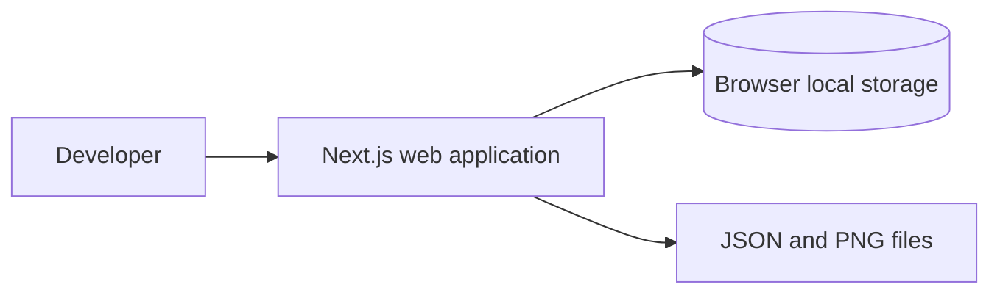
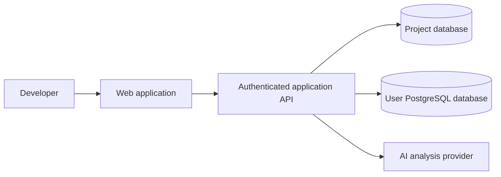

# Architecture: SQL-to-ERD

- Status: Draft
- Version: 0.1
- Scope: Phase 1 MVP with documented extension points

## 1. Architectural goals

The architecture must make the Phase 1 browser-only product simple while protecting four future capabilities:

1. Cloud project persistence
2. Authentication and authorization
3. PostgreSQL schema import through a server
4. AI-assisted schema analysis

The MVP must not implement those future capabilities. It should only avoid choices that make them unnecessarily expensive.

Primary quality attributes:

- Correctness and testability of schema transformations
- Clear vendor boundaries
- Recoverable editor state
- Privacy by default
- Stable diagram identity across re-parses
- Small, reviewable modules suitable for agent-assisted development

## 2. System context

### Phase 1 context



There is no application server dependency for project behavior in Phase 1. Next.js provides the application shell, routing, build, and deployment target. Parsing and diagram work occur in the browser.

### Future context



Future server boundaries are introduced only when a phase requires them.

## 3. Core data flow

```mermaid
flowchart LR
    SQL[SQL source text]
    Parser[PostgreSQL parser library]
    Adapter[PostgreSQL parser adapter]
    Schema[DatabaseSchema]
    Mapper[Schema-to-graph mapper]
    Layout[Layout adapter]
    Diagram[Diagram graph]
    UI[React Flow UI]

    SQL --> Parser --> Adapter --> Schema --> Mapper --> Layout --> Diagram --> UI
```



Important rules:

- The parser library AST is an implementation detail of the adapter.
- `DatabaseSchema` is the canonical representation used by all downstream behavior.
- React Flow types do not appear in `DatabaseSchema`.
- ELK-specific types do not appear outside the layout adapter.
- User layout state is separate from the schema graph.

## 4. Proposed repository structure

The exact filenames may evolve, but dependency direction should remain consistent.

```text
src/
  app/
    layout.tsx
    page.tsx
  features/
    editor/
      components/
      state/
      use-cases/
    diagram/
      components/
      graph/
      layout/
    project/
      persistence/
      serialization/
  domain/
    schema/
      model.ts
      identifiers.ts
      diagnostics.ts
      validation.ts
  adapters/
    parser/
      postgres/
    layout/
      elk/
    persistence/
      local-storage/
    export/
  shared/
    result.ts
    exhaustive.ts
fixtures/
  postgres/
docs/
```

### Dependency direction

```text
UI/features -> application use cases -> domain contracts
adapters -----------------------------> domain contracts
```

The domain layer imports no code from Next.js, React, React Flow, ELK, browser APIs, or parser packages.

## 5. Canonical domain model

The exact TypeScript syntax can be refined during implementation, but the following semantics are required.

```ts
export type SqlDialect = 'postgresql';

export interface DatabaseSchema {
  version: 1;
  dialect: SqlDialect;
  defaultSchema: string;
  tables: TableDefinition[];
  foreignKeys: ForeignKeyDefinition[];
}

export interface TableDefinition {
  id: string;
  schemaName: string;
  name: string;
  displayName: string;
  columns: ColumnDefinition[];
  primaryKey: KeyConstraint | null;
  uniqueConstraints: KeyConstraint[];
}

export interface ColumnDefinition {
  id: string;
  tableId: string;
  name: string;
  displayName: string;
  ordinal: number;
  dataType: string;
  nullable: boolean;
  defaultExpression: string | null;
}

export interface KeyConstraint {
  id: string;
  name: string | null;
  columnIds: string[];
}

export interface ForeignKeyDefinition {
  id: string;
  name: string | null;
  sourceTableId: string;
  sourceColumnIds: string[];
  targetTableId: string;
  targetColumnIds: string[];
  onDelete: ReferentialAction | null;
  onUpdate: ReferentialAction | null;
}

export type ReferentialAction =
  | 'NO ACTION'
  | 'RESTRICT'
  | 'CASCADE'
  | 'SET NULL'
  | 'SET DEFAULT';
```

### Model rules

- Array order is significant for composite keys.
- The schema model contains semantic database structure, not UI placement.
- `displayName` preserves user-facing identifier spelling.
- IDs are deterministic and stable for the same normalized identifier.
- Names of anonymous constraints may be `null`; IDs must still be deterministic.
- Data types and default expressions are retained as displayable PostgreSQL text.
- A table may appear after a foreign key statement in the source; resolution happens after statement collection.

## 6. PostgreSQL identifier strategy

PostgreSQL treats unquoted identifiers differently from quoted identifiers. The adapter must maintain both canonical identity and original display text.

Proposed normalization rules:

- Unquoted identifiers are canonicalized to lowercase.
- Quoted identifiers preserve case and content after unescaping.
- An unqualified table uses the configured default schema, initially `public`.
- A table ID is derived from canonical schema and table identifiers.
- A column ID is derived from the table ID and canonical column identifier.
- IDs use an escaping or length-prefix scheme that prevents separator collisions.

Do not rely on concatenation with an unescaped dot alone.

The same identifier utility must be used by parsing, relation resolution, layout persistence, and graph mapping.

## 7. Parse contract and diagnostics

The parser adapter exposes an application-owned result.

```ts
export interface ParseSqlInput {
  dialect: 'postgresql';
  sql: string;
  defaultSchema?: string;
}

export type ParseSqlResult =
  | {
      ok: true;
      schema: DatabaseSchema;
      diagnostics: Diagnostic[];
    }
  | {
      ok: false;
      diagnostics: Diagnostic[];
    };
```

A warning may be returned in a successful result. Any error produces `ok: false` and prevents committing a new schema.

```ts
export interface Diagnostic {
  code: DiagnosticCode;
  severity: 'warning' | 'error';
  message: string;
  range: SourceRange | null;
  details?: Record<string, string | number | boolean | null>;
}
```

Diagnostic codes and behavior are specified in `docs/parser-coverage.md`.

### Last-valid-schema policy

Editor state tracks at least:

- Current SQL text
- Last successfully parsed schema
- Diagnostics for the latest parse attempt
- Diagram layout keyed by stable table IDs
- Whether the visible diagram is stale relative to current SQL

A failed parse updates diagnostics and stale status but not the last valid schema.

## 8. Application state

The first implementation should favor a feature-local reducer over a global state library.

Illustrative state:

```ts
interface EditorState {
  sourceSql: string;
  parseStatus: 'idle' | 'parsing' | 'valid' | 'invalid';
  lastValidSchema: DatabaseSchema | null;
  diagnostics: Diagnostic[];
  lastParsedSqlHash: string | null;
  layout: DiagramLayout;
  persistenceStatus: 'idle' | 'saving' | 'saved' | 'error';
}
```

Derived values such as `isDiagramStale` should be computed from source and parse metadata rather than maintained independently when practical.

## 9. Diagram graph boundary

The domain schema is mapped to an application-owned graph before conversion into React Flow values.

```ts
interface DiagramGraph {
  nodes: DiagramNode[];
  edges: DiagramEdge[];
}

interface DiagramNode {
  id: string;
  tableId: string;
  width?: number;
  height?: number;
}

interface DiagramEdge {
  id: string;
  foreignKeyId: string;
  sourceTableId: string;
  targetTableId: string;
}
```

The graph mapper is pure and testable. React Flow node handles and rendering details are applied in a presentation adapter.

### Edge semantics

A composite foreign key is one logical `DiagramEdge`. Column-level attachment can be added through handles or metadata without splitting the domain relation into multiple edges.

## 10. Layout architecture

ELK.js is used through a layout adapter.

```ts
interface LayoutEngine {
  layout(input: LayoutRequest): Promise<LayoutResult>;
}
```

Responsibilities:

- Accept vendor-neutral nodes, edges, dimensions, and layout options.
- Return positions keyed by node ID.
- Convert to and from ELK-specific values only inside the adapter.
- Expose failure as a typed application error.

### Position merge policy

On first parse:

- Layout every node.

On subsequent parse:

- Retain positions for existing table IDs.
- Remove positions for deleted tables.
- Layout only newly added tables when practical.
- Allow a user-invoked **Re-layout all** action to replace every position.

An initial implementation may perform a complete layout and then merge existing positions, provided overlap handling is acceptable and covered by tests.

## 11. Persistence architecture

### Project document

Local storage and JSON export use the same versioned document shape.

```ts
interface ProjectDocumentV1 {
  formatVersion: 1;
  projectId: string;
  name: string;
  dialect: 'postgresql';
  sourceSql: string;
  layout: DiagramLayout;
  schemaSnapshot?: DatabaseSchema;
  updatedAt: string;
}
```

Rules:

- `sourceSql` is authoritative.
- `schemaSnapshot` is an optional cache and recovery aid.
- Loading should re-parse source SQL when possible.
- Imported and stored data is validated at runtime.
- Unknown format versions are rejected with a user-visible message.
- Storage writes should be debounced and should not occur on every diagram animation frame.

### Repository boundary

```ts
interface ProjectRepository {
  load(projectId: string): Promise<ProjectDocumentV1 | null>;
  save(project: ProjectDocumentV1): Promise<void>;
  remove(projectId: string): Promise<void>;
}
```

Phase 1 implementation:

```text
LocalStorageProjectRepository
```

Phase 2 implementation:

```text
RemoteProjectRepository
```

Do not build the remote implementation during Phase 1.

## 12. Export architecture

### JSON export

- Serialize the validated project document.
- Use a deterministic filename where practical.
- Do not include secrets or browser-specific transient values.

### PNG export

- Isolate canvas or DOM-to-image library behavior in an export adapter.
- Export diagram content without editor controls.
- Handle large diagrams and export failures explicitly.
- Add SVG only in a later task if it does not compromise the MVP schedule.

## 13. UI component boundaries

Illustrative hierarchy:

```text
app/page.tsx
  ErdWorkspace (client boundary)
    WorkspaceToolbar
    SqlEditorPanel
      SqlEditor
      ParseDiagnostics
    DiagramPanel
      DiagramToolbar
      ErdCanvas
        TableNode
    ImportExportControls
```

Guidelines:

- `ErdWorkspace` coordinates application state and use cases.
- `SqlEditor` does not parse SQL directly.
- `TableNode` receives presentation-ready data and does not read global schema state.
- `ErdCanvas` does not know parser AST details.
- Toolbar actions call explicit use-case functions rather than manipulating storage or parser libraries directly.

## 14. Next.js boundaries

Phase 1:

- `app/page.tsx` may remain a Server Component that renders the client workspace.
- Browser-dependent editor, storage, parser, layout, and export code must execute only within client-safe modules.
- Avoid importing browser-only dependencies from server-rendered modules.
- No Route Handler is required for core MVP behavior.

Future phases:

- Phase 2 can introduce authenticated Route Handlers or server actions for project persistence.
- Phase 3 must perform target database access on a server boundary.
- Phase 4 must call external AI APIs from a server boundary so provider credentials never reach the browser.

## 15. Testing architecture

### Unit tests

- Identifier normalization
- AST-to-domain normalization helpers
- Constraint and relation resolution
- Schema-to-graph mapping
- Position merge logic
- Project serialization, validation, and migration
- Diagnostic formatting

### Fixture tests

For each SQL fixture:

1. Parse the complete file.
2. Normalize it into `DatabaseSchema`.
3. Assert semantic structure rather than parser AST shape.
4. Use explicit assertions or reviewed snapshots for table IDs, columns, constraints, and foreign keys.

### Component tests

Use only where they provide value beyond pure function tests:

- Diagnostic rendering
- Table metadata rendering
- Critical toolbar states

### End-to-end tests

Minimum paths:

- Load sample -> Parse -> Diagram appears
- Edit invalid SQL -> Error appears -> Previous diagram remains
- Move a node -> Refresh -> Position restores
- Export JSON -> Reset -> Import JSON -> State restores
- Export PNG

Do not assert exact ELK coordinates in end-to-end tests.

## 16. Performance strategy

Start with a simple main-thread implementation and measure.

Optimization order:

1. Avoid parsing and layout on each keystroke.
2. Memoize pure graph mapping only when profiling shows a benefit.
3. Debounce persistence writes.
4. Limit unnecessary React Flow object recreation.
5. Move parser or layout work to a Web Worker only after measuring blocking behavior.

Do not introduce workers before the parser library and serialization contracts are stable.

## 17. Security and privacy

Phase 1 controls:

- Never execute SQL.
- Never transmit SQL.
- Do not render SQL-derived strings through raw HTML.
- Validate imported files.
- Fail closed on unknown project document versions.
- Avoid remote telemetry containing schema content.

Future database import controls:

- Browser never connects directly to a target database.
- Recommend a read-only database role.
- Permit only predefined metadata queries.
- Do not persist credentials by default.
- If credentials are ever persisted, perform a separate threat model and key-management design.

Future AI controls:

- Send normalized schema metadata, not credentials.
- Obtain explicit user consent.
- Return structured findings.
- Distinguish deterministic errors from probabilistic recommendations.
- Require user approval before applying changes.

## 18. Evolution by phase

### Phase 1

```text
PostgreSQL SQL -> DatabaseSchema -> ERD
LocalStorageProjectRepository
```

### Phase 2

```text
Authentication + authorization
RemoteProjectRepository
Local-to-cloud project migration
```

### Phase 3

```text
PostgreSQL catalog reader -> DatabaseSchema
Manual schema re-sync
```

### Phase 4

```text
DatabaseSchema -> deterministic checks -> AI analyzer -> structured findings
```

Every new input path must produce the same canonical schema model. Every new persistence path must read and write a versioned project document.

## 19. Architecture decision checklist

A proposed change requires an explicit architecture update when it:

- Changes the canonical schema model
- Changes stable identifier semantics
- Changes persisted or exported document formats
- Adds a server boundary
- Sends schema content to a third party
- Adds a new SQL dialect
- Replaces parser, graph, layout, or persistence vendors
- Introduces global state management
- Adds database credential handling
