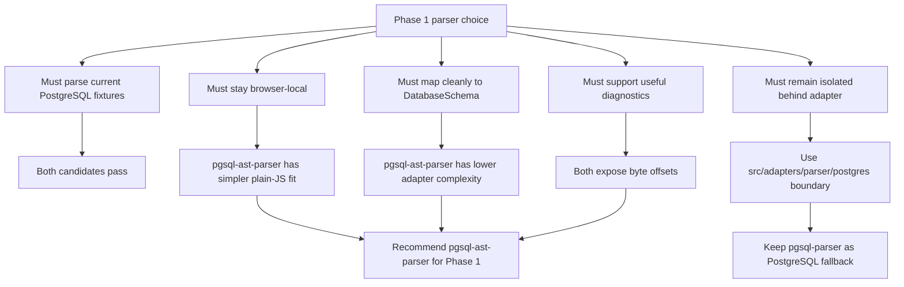

# Parser Spike Result

- Status: Draft
- Milestone: 3
- Date: 2026-06-21
- Scope: PostgreSQL parser library selection for Phase 1

## Candidates Evaluated

| Candidate | Version | License | Notes |
|---|---:|---|---|
| `pgsql-ast-parser` | `12.0.2` | MIT | TypeScript-friendly PostgreSQL parser. README states it works in Node and browser, supports `locationTracking`, and exposes `locationOf(node)`. |
| `pgsql-parser` | `17.9.15` | MIT | Wrapper around `libpg-query` and PostgreSQL AST types. Context7 docs describe it as a `libpg-query` WASM-backed parser. |

## Candidates Excluded From Recommendation

| Candidate | Version | Reason |
|---|---:|---|
| `pg-query-parser` | `0.3.0` | Older package, depends on native `pg-query-native`, and is a poor fit for browser-first Phase 1 parsing. |
| `node-sql-parser` | `5.4.0` | General SQL parser with very large unpacked package size and less direct PostgreSQL DDL/constraint focus than the two primary candidates. |

## Evaluation Criteria

- Parses all three Phase 1 fixtures without production code changes.
- Exposes enough AST detail for `CREATE TABLE`, inline constraints, table-level constraints, and `ALTER TABLE ... ADD CONSTRAINT ... FOREIGN KEY`.
- Preserves schema-qualified and quoted identifiers well enough for Erdium's canonical identifier utilities.
- Provides source location data for diagnostics, or a clear fallback path.
- Can run in a browser or browser-compatible WASM boundary without sending SQL to a server.
- Has a compatible license and acceptable maintenance activity.
- Can be isolated behind `src/adapters/parser/postgres` in Milestone 4 without leaking vendor AST types.

## Decision Scorecard

| Criterion | Weight | `pgsql-ast-parser` | `pgsql-parser` |
|---|---|---|---|
| Phase 1 fixture coverage | High | Passes all current fixtures and quoted identifier probe. | Passes all current fixtures and quoted identifier probe. |
| Adapter complexity | High | Lower. AST uses direct statement and constraint names close to Erdium's domain language. | Higher. PostgreSQL AST variants and action codes require more mapping logic. |
| Browser fit | High | Plain JavaScript package with explicit browser support in README. | WASM-backed through `libpg-query`; viable, but initialization and bundling need more care. |
| Diagnostics support | High | Byte offsets available through `locationTracking`, `_location`, and `locationOf(node)`. | Byte offsets available through `location`, `stmt_location`, and `stmt_len`, with shape varying by node. |
| Type/default display preservation | Medium | Type modifiers and default expression nodes are exposed in adapter-friendly shapes. | PostgreSQL canonicalization can rewrite aliases such as `BIGINT` to `pg_catalog.int8`; source slicing may be required. |
| PostgreSQL grammar fidelity | Medium | Good enough for current DDL fixtures; not the real PostgreSQL grammar. | Stronger grammar fidelity because it wraps `libpg-query`. |
| Maintenance and license | Medium | MIT, recently published, small dependency set. | MIT, recently published, maintained package family. |
| Future dialect fit | Medium | Good as a PostgreSQL adapter dependency, not a general multi-dialect strategy. | Good as a PostgreSQL fallback, not a general multi-dialect strategy. |
| Recommendation | - | Primary candidate for the Phase 1 PostgreSQL adapter. | Fallback if future PostgreSQL fixtures exceed `pgsql-ast-parser` coverage. |

## Decision Flow



## Fixture Results

Run:

```bash
pnpm --dir spikes/parser-library install
pnpm --dir spikes/parser-library run inspect
```

| Fixture | `pgsql-ast-parser` | `pgsql-parser` |
|---|---|---|
| `basic.sql` | Pass. Parsed 2 `create table` statements with schema-qualified names, columns, inline PK/unique/not-null constraints, table-level composite PK/unique constraints, default expressions, and byte-offset locations. | Pass. Parsed 2 `CreateStmt` nodes with schema-qualified names, column constraints, table constraints, defaults, and node/statement locations. |
| `foreign-key.sql` | Pass. Parsed 6 `create table` statements with inline FK, table-level FK, composite FK, named/anonymous constraints, ordered local/foreign columns, and `onDelete`/`onUpdate` strings. | Pass. Parsed 6 `CreateStmt` nodes with inline and table-level `CONSTR_FOREIGN` constraints, ordered `fk_attrs`/`pk_attrs`, and referential action codes. |
| `alter-table.sql` | Pass. Parsed 3 `create table` and 2 `alter table` statements. `ADD CONSTRAINT ... FOREIGN KEY` appears as `changes[].constraint` with table/schema, local columns, target table/columns, and actions. | Pass. Parsed 3 `CreateStmt` and 2 `AlterTableStmt` nodes. `ADD CONSTRAINT ... FOREIGN KEY` appears as `AlterTableCmd` with `AT_AddConstraint` and `CONSTR_FOREIGN`. |
| quoted identifier probe | Pass. Preserved quoted schema/table/column case and dot characters: `"App"."User.Profile"`, `"ID"`, and escaped quote content. | Pass. Preserved quoted schema/table/column content in PostgreSQL AST fields. |

## AST Observations

### `pgsql-ast-parser`

- Top-level statement types are simple strings such as `create table` and `alter table`.
- Table identifiers appear as `{ schema, name }` when schema-qualified and `{ name }` when unqualified.
- Columns expose `name`, `dataType`, `constraints`, and `_location`; type modifiers such as `VARCHAR(255)` appear as `dataType.config`.
- Inline FK constraints appear on the column as `type: "reference"` with `foreignTable`, `foreignColumns`, and action fields.
- Table-level FK constraints expose `localColumns`, `foreignTable`, `foreignColumns`, optional `constraintName`, and `onDelete`/`onUpdate` values such as `cascade`, `restrict`, and `set null`.
- `ALTER TABLE ... ADD CONSTRAINT` exposes `changes[].type: "add constraint"` with the same FK constraint shape.
- `locationOf(node)` and `_location` provide byte offsets. The adapter must convert offsets to 1-based line/column for `SourceRange`.

### `pgsql-parser`

- Top-level statement nodes are PostgreSQL-style variants such as `CreateStmt` and `AlterTableStmt` under `RawStmt`.
- Table identifiers appear under `relation.schemaname` and `relation.relname`.
- Columns appear as `ColumnDef`; inline constraints use `Constraint.contype` values such as `CONSTR_PRIMARY`, `CONSTR_UNIQUE`, `CONSTR_NOTNULL`, `CONSTR_DEFAULT`, and `CONSTR_FOREIGN`.
- Table-level and alter-table FKs expose `fk_attrs`, `pk_attrs`, `pktable`, `conname`, and action code fields `fk_del_action` and `fk_upd_action`.
- Type aliases may be canonicalized by PostgreSQL, for example `BIGINT` becomes `pg_catalog.int8`; adapter display text would need source slicing or deparse rules to preserve user-facing type text.
- Source locations are available as byte offsets such as `location`, `stmt_location`, and `stmt_len`, but shape varies by node.

## Browser And Bundle Observations

- `pgsql-ast-parser` README states it works in Node and browser. It is plain JavaScript with `moo` and `nearley` dependencies. Local pnpm package footprint was about 2.2 MB for the package folder.
- `pgsql-parser` is documented as a wrapper around `libpg-query` WASM. Local pnpm package footprint was about 32 KB for `pgsql-parser` plus about 1.2 MB for `libpg-query`; it also installs `pgsql-deparser` and `@pgsql/types`.
- `pgsql-parser` is more grammar-authoritative, but the adapter must handle WASM initialization and verbose PostgreSQL AST variants.
- `pgsql-ast-parser` has a simpler adapter surface and direct source ranges for the Phase 1 DDL subset, but it is not the real PostgreSQL grammar.

## Future Dialect Implications

This spike selects a PostgreSQL parser for Phase 1 only. It does not choose a parser strategy for every future DBMS.

Phase 1 remains PostgreSQL-only because the PRD explicitly excludes multiple SQL dialects. Expanding now would blur the MVP boundary and force early decisions about MySQL, SQLite, SQL Server, or other dialect-specific behavior.

Future dialect support should follow these rules:

- Add a separate dialect spike before adding a parser dependency for that DBMS.
- Add dialect adapters under `src/adapters/parser/<dialect>` rather than sharing vendor AST types.
- Keep `DatabaseSchema` as the application-owned relational model and extend it only when a new dialect exposes a real semantic gap.
- Keep dialect-specific identifier normalization separate. PostgreSQL lowercases unquoted identifiers, while other DBMSs can differ.
- Add separate fixture coverage documents, for example `docs/mysql-parser-coverage.md`, before claiming support.

## Phase 1 PostgreSQL Recommendation

Use `pgsql-ast-parser@12.0.2` for the Milestone 4 PostgreSQL parser adapter.

Reasoning:

- It parsed all current Phase 1 fixtures and the quoted identifier probe.
- Its AST shape is much closer to Erdium's canonical schema model, reducing adapter complexity.
- It preserves data-type modifiers and default expression nodes in a form that can be converted or source-sliced for display.
- It exposes useful byte-offset source locations through `locationTracking` and `locationOf`.
- Its browser compatibility is explicit in the package README, which fits Phase 1 local-first parsing.

Keep `pgsql-parser@17.9.15` as the fallback candidate if future fixtures expose PostgreSQL grammar coverage gaps in `pgsql-ast-parser`.

## Risks

- `pgsql-ast-parser` may accept only common PostgreSQL syntax, so later PostgreSQL edge cases could require replacement.
- `pgsql-parser` is closer to PostgreSQL's real grammar, but WASM initialization and AST verbosity may increase adapter complexity.
- Source location support must be confirmed against actual parse errors, not just successful statement ASTs.
- The selected package must remain behind a parser adapter; production modules must not import vendor AST types directly.
- `pgsql-ast-parser` lowercases normal unquoted SQL tokens in its AST. The adapter should use source locations when exact display text matters, especially for type text and defaults.
